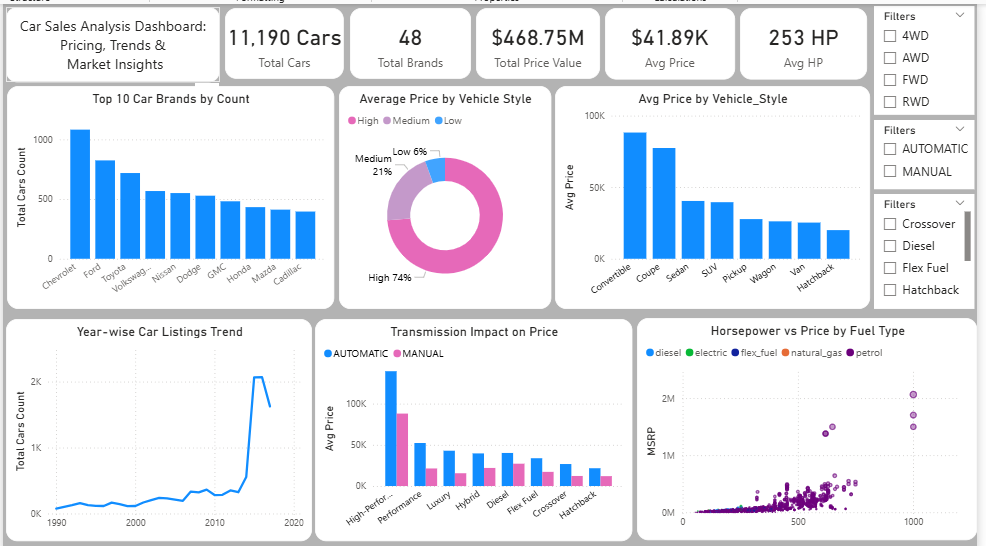

# 🚗 Car Sales Analysis Dashboard

## 📌 Overview
This project analyzes car sales data to uncover pricing trends, customer preferences, and market insights.

## 🛠 Tools Used
- Python (Pandas, Matplotlib, Seaborn)
- Power BI

## 📊 Key Insights
- Convertibles and coupes have the highest prices
- Most customers prefer mid-range vehicles
- Automatic cars are more expensive than manual
- Strong relationship between horsepower and price
- Sales increased significantly after 2014

## 📸 Dashboard

## 📁 Files
- data_processing.ipynb → Data cleaning
- analysis.ipynb → Analysis
- visual.ipynb → Visualization
- dashboard.pbix → Power BI dashboard
